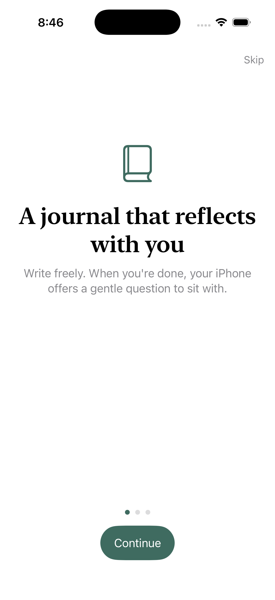
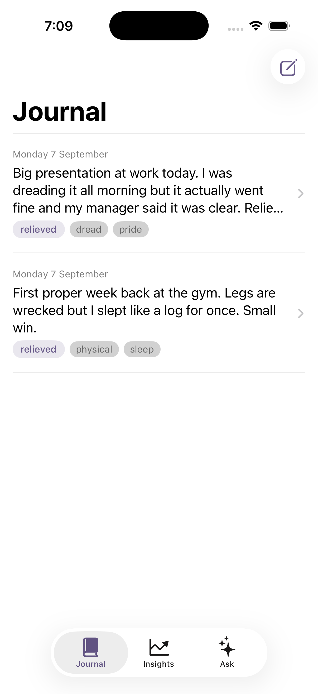
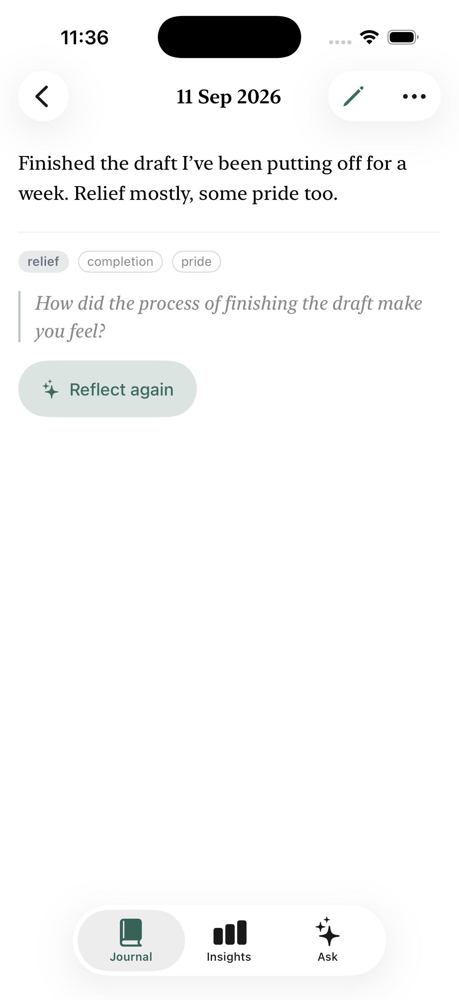
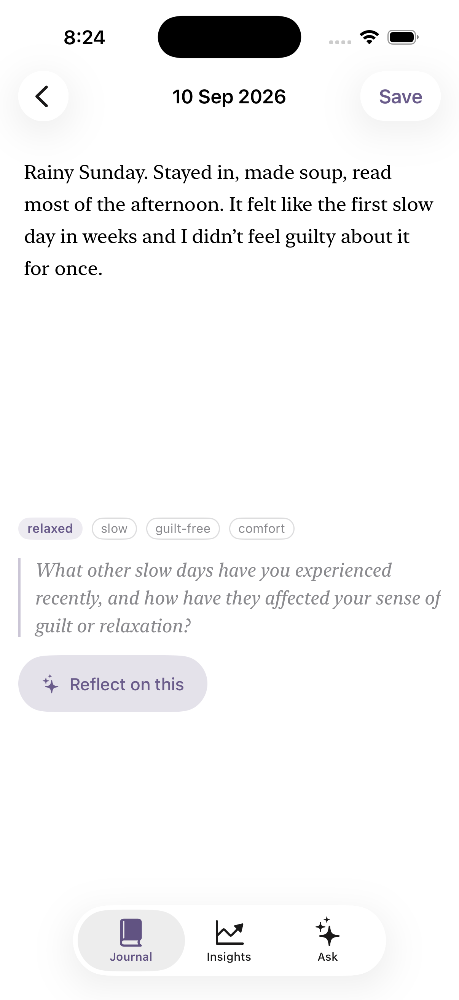
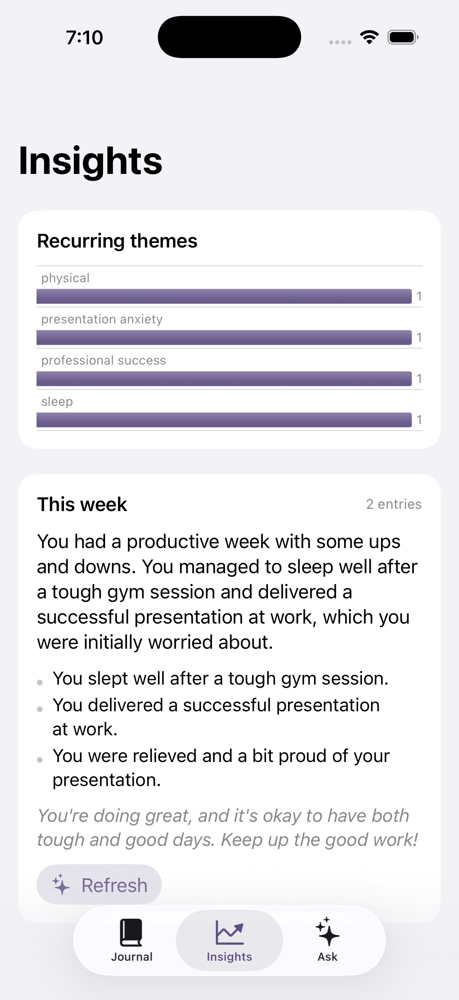
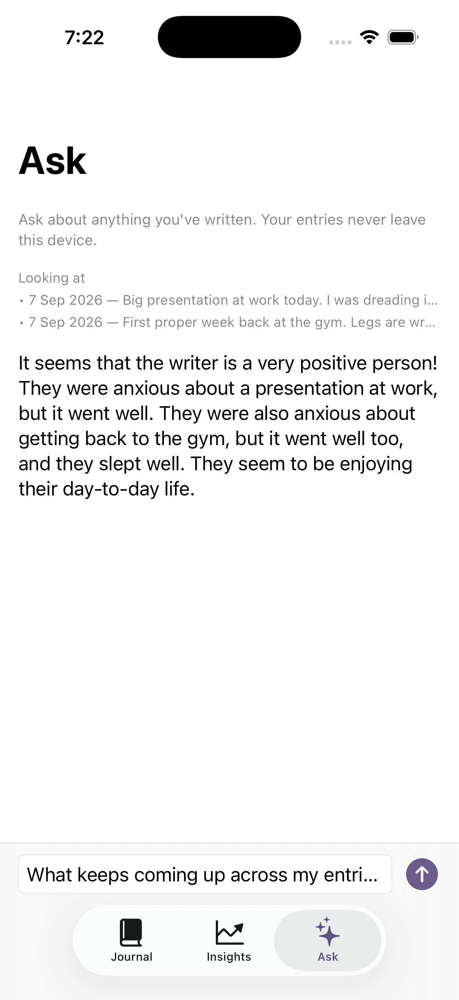

# Reflect

A private journaling app. The reflection features — a gentle follow-up question
per entry, a weekly digest, and "ask your journal" — run **entirely on device**
using Apple's **Foundation Models** framework (iOS 26). No network, no API key,
nothing leaves the phone.

| Onboarding | Journal | Read mode |
| --- | --- | --- |
|  |  |  |
| Three quiet screens, shown once | Grouped by month, mood as the one spot of colour | Calm read-only view; editing is a deliberate tap away |

| Editor | Insights | Ask |
| --- | --- | --- |
|  |  |  |
| Auto-saves as you type; stream a reflective question | Theme-frequency chart + a written weekly digest | Free-text Q&A grounded in the entries it retrieves |

*All text in the screenshots above was generated on-device by the model — no network.*

## What it demonstrates

| Area | Detail |
| --- | --- |
| **Foundation Models** | `SystemLanguageModel` availability handling, `LanguageModelSession`, **structured output** with `@Generable` / `@Guide` (`EntryReflection`, `WeeklyDigest`), **streamed** responses, per-request timeout, friendly mapping of `GenerationError` (guardrail / context-window / not-ready) |
| **Context management** | The on-device model has a small context window, so `EntryRetrieval` ranks past entries by keyword overlap, falls back to recency, and trims to a character budget before they're sent — a mini retrieval step, pure and unit-tested |
| **Graceful degradation** | When Apple Intelligence is off or still downloading, the journal stays fully usable; only the reflection features switch off, with an inline reason. Stale "analysing" flags are cleared on launch |
| **Read / edit separation** | Tapping an entry opens a read-only `EntryDetailView` (serif, the reflection shown prominently); editing is a deliberate tap on the pencil, which opens the auto-saving editor as a sheet |
| **Design system** | A small `Theme.swift` — spacing scale, a serif `.journalText()` modifier for anything the writer or the model wrote, a `SectionHeader`, a `MoodPalette` that buckets the model's free-text mood into five muted colours, `Color.brand` (light + dark) |
| UI | SwiftUI, `@Entry` environment injection, `Tab`-based `TabView`, `ContentUnavailableView`, Swift Charts, `.sensoryFeedback` haptics, Dynamic Type–capped chart labels |
| Persistence | SwiftData (`@Model JournalEntry`), auto-save while typing, background analysis after save |
| Concurrency | `async`/`await`, `AsyncThrowingStream`, `withThrowingTaskGroup` timeouts, task cancellation on view teardown |
| Testing | `StubJournalIntelligence` for previews + tests; 16 unit tests (retrieval ranking/budget, insights planning, "on this day" date logic, streaming contract) |
| Dependencies | none |

## Project layout

```
Reflect/
├── App/            ReflectApp, RootView, environment key, preview data
├── Models/         JournalEntry (@Model)
├── Intelligence/
│   ├── JournalIntelligence.swift              protocol + availability + errors
│   ├── GenerableTypes.swift                   @Generable EntryReflection / WeeklyDigest
│   ├── FoundationModelsJournalIntelligence.swift   the on-device implementation
│   ├── StubJournalIntelligence.swift          deterministic stub for previews/tests
│   └── EntryRetrieval.swift                   context selection for "Ask"
├── Features/
│   ├── Onboarding/ three-page intro, shown once (@AppStorage-gated)
│   ├── Timeline/   grouped-by-month list, first-run prompts, "on this day"
│   ├── Detail/     read-only entry view (EntryDetailView)
│   ├── Editor/     auto-saving editor + stream a reflective question
│   ├── Insights/   InsightsPlanner (pure) + charts + weekly digest
│   └── Ask/        retrieval + streamed answer
└── DesignSystem/   Theme.swift (spacing, serif type, MoodPalette) + Components.swift
ReflectTests/       EntryRetrieval, InsightsPlanner, TimelinePlanner, StubJournalIntelligence
```

## Running it

1. **Xcode 26** or newer. Open `Reflect.xcodeproj`, pick an iPhone 15 Pro / 16 /
   17 simulator (or a device), press **⌘R**. Tests: **⌘U** (16, all passing).
2. **Apple Intelligence must be enabled** for the reflection features to run:
   - **Simulator:** turn it on for the host Mac (System Settings ▸ Apple
     Intelligence & Siri); the model downloads once and the simulator inherits it.
   - **Device:** Settings ▸ Apple Intelligence & Siri, iPhone 15 Pro or newer.
3. If Apple Intelligence is off or still downloading, the journal stays fully
   usable and the reflection features show an inline reason instead — that
   fallback path is deliberate, not an error.

```bash
xcodebuild -project Reflect.xcodeproj -scheme Reflect \
  -destination 'platform=iOS Simulator,name=iPhone 17 Pro' build test
```

## Notes on the model

The on-device model is small (~3B params). It's used only for tasks it's good at
— naming a feeling, spotting themes, short reflective questions, brief summaries
— never for facts or advice. Prompts are written as narrow tasks, structured
output is constrained with `@Guide`, and every request has a timeout.
